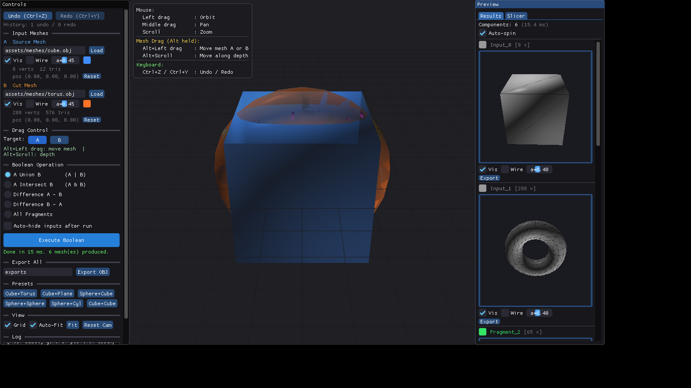
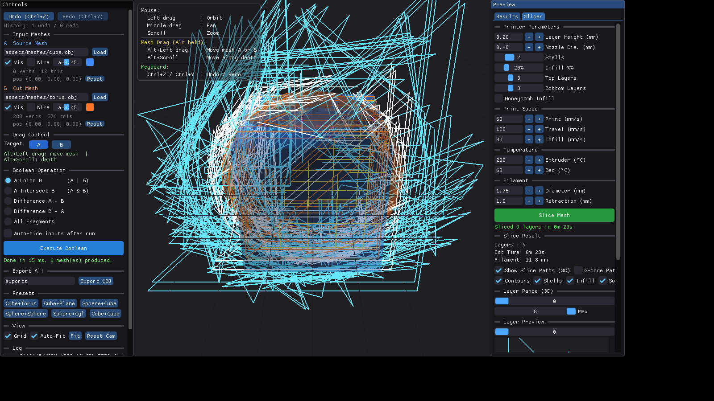

# MCUT Boolean Viewer

一个基于 **MCUT** 网格布尔运算库、**ImGui** 和 **OpenGL 3.3** 构建的交互式 3D 网格布尔运算可视化工具，集成了 **FDM 3D 打印切片算法**和 **G-code 导出与预览**功能。

---

## ✨ 功能特性

### 网格布尔运算
- **5 种布尔运算**：Union（并集）、Intersection（交集）、Difference A-B、Difference B-A、All Fragments
- **交互式网格拖动**：`Alt + 左键` 拖动移动网格（A 或 B），`Alt + 滚轮` 沿深度轴移动，松开后自动重算布尔结果
- **实时 3D 渲染**：OpenGL 轨迹球相机（左键旋转、中键平移、滚轮缩放）

### 结果预览
- **右侧 CC 分层预览面板**：每个连通分量（Connected Component）用独立 FBO（256×256）渲染缩略图，支持自动旋转、拖动旋转、点击聚焦、颜色编辑、单独导出
- **Snapshot Undo/Redo**：`Ctrl+Z` / `Ctrl+Y`，最多 20 个快照，记录完整状态

### 3D 打印切片（新功能）
- **FDM 切片算法**：平面-三角形求交、轮廓提取、外壳（Perimeter）生成、蜂窝/光栅填充路径生成
- **切片参数控制**：层高、喷嘴直径、外壳数量、填充率、顶层/底层数量、打印速度、温度、耗材参数
- **G-code 导出**：完整 FDM G-code 生成（含温度控制、挤出量计算、回抽处理）
- **3D 切片路径预览**：在主视口中叠加显示切片层轮廓（蓝色）、外壳（青色）、填充（橙色）、实心层（黄色）、空走路径（灰色）
- **层缩略图**：右侧面板 Slicer Tab 中显示单层 2D 预览
- **打印时间与耗材估算**

### 构建系统
- **OrcaSlicer 风格自包含依赖构建**：`deps/CMakeLists.txt` 用 `ExternalProject_Add` 自动下载编译所有依赖（MCUT 1.3.0、GLFW 3.4、GLM 1.0.1、GLAD、ImGui 1.91.6），**无需 vcpkg 或手动安装**
- **Windows/Linux 一键构建脚本**：`build_deps.sh` / `build_deps.bat`

---

## 📸 截图

| 布尔运算结果（6 个连通分量，15ms） | 切片功能（9 层，G-code 路径预览） |
|:---:|:---:|
|  |  |

---

## 🛠️ 编译与构建（自包含依赖方案）

本项目自带完整的依赖构建脚本，支持 Windows、Linux 和 macOS 平台。

### 前置环境要求

- **CMake** (≥ 3.16)
- **Git** (用于自动下载依赖源码)
- **C++17 兼容的编译器** (GCC, Clang, 或 MSVC 2019/2022)

**Linux 额外依赖（窗口系统头文件）：**
```bash
sudo apt-get update
sudo apt-get install -y build-essential cmake libgl1-mesa-dev \
    libx11-dev libxrandr-dev libxinerama-dev libxcursor-dev libxi-dev
```

**macOS 额外依赖：**
```bash
xcode-select --install
brew install cmake
```

### 🚀 一键构建命令

#### Linux / macOS
```bash
# 赋予执行权限
chmod +x build_deps.sh

# 一键编译依赖和主程序（首次运行需下载依赖，约 5 分钟；后续为秒级）
./build_deps.sh

# 运行程序
cd build
./mcut_viewer
```

#### Windows (MSVC)
打开 **x64 Native Tools Command Prompt for VS 2022**（或 2019）：
```cmd
:: 一键编译依赖和主程序（首次运行需下载依赖，约 10 分钟；后续为秒级）
build_deps.bat

:: 运行程序
cd build\Release
mcut_viewer.exe
```

### 🔧 高级构建选项

| 命令参数 | 说明 |
|----------|------|
| `Release` / `Debug` | 指定构建类型（默认为 Release） |
| `--app-only` | 仅重新编译主程序（修改源码后快速增量编译） |
| `--deps-only` | 仅编译依赖库 |
| `clean` | 删除所有构建目录，彻底重建 |

```bash
# 修改代码后快速增量编译
./build_deps.sh --app-only
```

---

## 🎮 使用指南

### 界面布局

程序启动后分为三个主要区域：

1. **左侧控制面板 (Controls)**：网格加载、预设选择、布尔运算类型切换、执行按钮
2. **中央 3D 视口 (Viewport)**：源网格（A）和切割网格（B）的 3D 预览，支持相机交互和切片路径叠加
3. **右侧预览面板 (Preview)**：包含两个 Tab：
   - **Results Tab**：布尔运算结果的 CC 缩略图列表
   - **Slicer Tab**：切片参数设置、切片执行、层预览和 G-code 导出

### 鼠标与键盘交互

**相机控制：**

| 操作 | 功能 |
|------|------|
| 左键拖动 | 轨道旋转 (Orbit) |
| 中键拖动 | 平移视口 (Pan) |
| 滚轮滚动 | 缩放 (Zoom) |

**网格拖动（实时布尔预览）：**

| 操作 | 功能 |
|------|------|
| `Alt + 左键拖动` | 在平行于屏幕的平面上移动选中网格（左侧 Drag Control 切换 A/B） |
| `Alt + 滚轮` | 沿相机深度轴前后移动网格 |

拖动结束后松开鼠标，程序自动重新执行布尔运算并刷新结果。

**快捷键：**

| 快捷键 | 功能 |
|--------|------|
| `Ctrl + Z` | 撤销上一步操作 |
| `Ctrl + Y` | 重做 |

### 切片功能使用

1. 执行布尔运算，得到结果网格
2. 切换到右侧面板的 **Slicer Tab**
3. 调整切片参数（层高、填充率、速度、温度等）
4. 点击绿色 **Slice Mesh** 按钮执行切片
5. 切片完成后：
   - 勾选 **Show Slice Paths (3D)** 在主视口中叠加显示切片路径
   - 使用 **Layer Range** 滑块控制显示的层范围
   - 在 **Layer Preview** 中查看单层 2D 缩略图
   - 点击 **Export G-code** 导出 `.gcode` 文件

### 切片参数说明

| 参数 | 默认值 | 说明 |
|------|--------|------|
| Layer Height | 0.20 mm | 每层切片厚度 |
| Nozzle Dia. | 0.40 mm | 喷嘴直径（影响挤出宽度） |
| Shells | 2 | 外壳（周长）数量 |
| Infill % | 20% | 填充密度 |
| Top Layers | 3 | 顶部实心层数量 |
| Bottom Layers | 3 | 底部实心层数量 |
| Honeycomb Infill | 关 | 蜂窝填充（开）或光栅填充（关） |
| Print Speed | 60 mm/s | 打印速度 |
| Travel Speed | 120 mm/s | 空走速度 |
| Infill Speed | 80 mm/s | 填充速度 |
| Extruder Temp | 200 °C | 挤出头温度 |
| Bed Temp | 60 °C | 热床温度 |
| Filament Dia. | 1.75 mm | 耗材直径 |
| Retraction | 1.0 mm | 回抽长度 |

---

## 📂 目录结构说明

```text
mcut-boolean-viewer/
├── build_deps.sh          # Linux/macOS 一键构建脚本
├── build_deps.bat         # Windows 一键构建脚本
├── CMakeLists.txt         # 主程序 CMake 配置
├── deps/                  # 依赖库构建系统 (ExternalProject_Add)
│   ├── CMakeLists.txt     # 自动下载/编译 MCUT, GLFW, GLM, ImGui, GLAD
│   └── ...
├── src/
│   └── main.cpp           # 主程序入口、渲染循环与 UI 逻辑
├── include/
│   ├── BooleanOp.h        # MCUT 布尔运算封装与执行
│   ├── Camera.h           # 轨迹球相机实现
│   ├── ObjLoader.h        # OBJ 文件解析器（基于 tinyobjloader）
│   ├── RenderMesh.h       # OpenGL 网格渲染封装
│   ├── Shader.h           # GLSL 着色器编译与管理
│   ├── SlicerEngine.h     # FDM 切片算法核心（平面求交、轮廓、填充）
│   ├── GcodeExporter.h    # G-code 生成器与可视化解析器
│   └── SlicerRenderer.h   # 切片路径 OpenGL 渲染器
├── shaders/               # 顶点与片段着色器
├── assets/meshes/         # 内置测试网格 (Cube, Sphere, Torus, Cylinder 等)
└── screenshots/           # 功能截图
```

---

## 🔧 技术栈

| 组件 | 版本 | 说明 |
|------|------|------|
| [MCUT](https://github.com/cutdigital/mcut) | 1.3.0 | 网格布尔运算核心库 |
| [GLFW](https://www.glfw.org/) | 3.4 | 跨平台窗口与 OpenGL 上下文 |
| [ImGui](https://github.com/ocornut/imgui) | 1.91.6 | 即时模式 GUI（Docking Branch） |
| [GLM](https://github.com/g-truc/glm) | 1.0.1 | OpenGL 数学库 |
| [GLAD](https://gen.glad.sh/) | glad2 | OpenGL 3.3 Core 函数加载器 |
| [tinyobjloader](https://github.com/tinyobjloader/tinyobjloader) | latest | OBJ 文件解析 |
| OpenGL | 3.3 Core | 图形渲染 API |

---

## 📜 开源协议

本项目自身代码采用 **MIT 协议**开源。

请注意，本项目依赖的 [MCUT](https://github.com/cutdigital/mcut) 库是双重授权软件（GNU LGPL v3+ 或商业授权）。如果您在商业产品中使用本工具或 MCUT，请务必遵守 MCUT 的开源协议或获取其商业授权。
