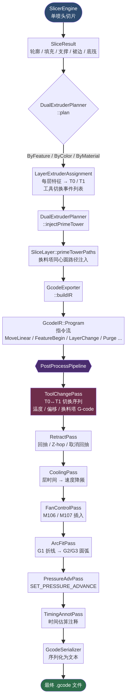
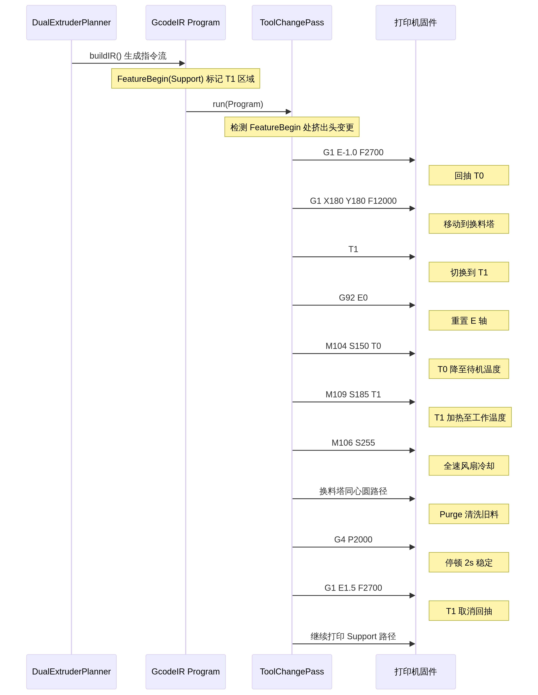

# MCUT Boolean Viewer 双喷头切片架构设计文档

**作者：** Manus AI  
**日期：** 2026-06-10  
**仓库：** [Jeremy-x-man/mcut-boolean-viewer](https://github.com/Jeremy-x-man/mcut-boolean-viewer)

---

## 1. 架构概述

MCUT Boolean Viewer 的双喷头（Dual Extruder）支持旨在为 FDM 3D 打印提供多材料、多色彩的切片能力。该架构深受 BambuStudio 的 `ExtruderManager`、`PrintConfig` 以及 LLVM Pass Manager 的设计理念启发，将双喷头逻辑以**非侵入式**的方式叠加在现有的单喷头切片流水线之上。

整个架构分为三个完全解耦的阶段，如下图所示：



**阶段一：路径规划与分配（DualExtruderPlanner）**  
在单喷头切片完成后，为每一层的不同几何特征分配挤出头，并注入换料塔（Prime Tower）几何路径。

**阶段二：中间表示生成（GcodeExporter）**  
将带有挤出头分配信息的几何路径转换为 G-code IR 指令流，并标记 `Purge` 等特殊特征区域。

**阶段三：后处理流水线（ToolChangePass）**  
在 IR 层拦截特征边界，插入完整的工具切换（Tool Change）序列，处理温度控制、坐标偏移和换料清洗。

---

## 2. 核心数据结构

双喷头架构依赖于一系列专门的数据结构来管理硬件配置和分配策略，主要定义在 `DualExtruder.h` 中。

### 2.1 ExtruderConfig（挤出头配置）

每个挤出头（T0 和 T1）都拥有独立的物理和工艺参数，允许使用不同特性的材料（如 PLA 作为主体，PVA 作为可溶性支撑）。

| 参数分类 | 字段 | 类型 | 说明 |
| :--- | :--- | :--- | :--- |
| **基础属性** | `index` | `int` | 挤出头索引（0 = T0，1 = T1） |
| | `material` | `string` | 材料名称（PLA / PETG / PVA / TPU） |
| | `color` | `glm::vec3` | UI 渲染颜色（RGB） |
| **喷嘴参数** | `nozzleDiameter` | `float` | 喷嘴直径（mm） |
| | `extrusionWidth` | `float` | 基础挤出线宽（mm） |
| | `outerExtrusionWidth` | `float` | 外壳挤出线宽（更窄，提升表面质量） |
| **温度控制** | `extruderTemp` | `float` | 打印工作温度（°C） |
| | `standbyTemp` | `float` | 非激活状态下的待机温度（°C） |
| | `firstLayerTemp` | `float` | 第一层打印温度（°C） |
| **回抽设置** | `retractionLength` | `float` | 回抽长度（mm，不同材料差异大） |
| | `retractionSpeed` | `float` | 回抽速度（mm/s） |
| | `retractionExtra` | `float` | 取消回抽时的额外补偿量（mm） |
| **空间偏移** | `offset` | `glm::vec2` | 相对于 T0 的 (X, Y) 物理偏移量（mm） |
| **冷却/风扇** | `minFanSpeed` | `int` | 最小风扇速度（0-255） |
| | `firstFanLayer` | `int` | 开始使用风扇的层号 |
| **压力补偿** | `pressureAdvance` | `float` | Klipper/Marlin 压力补偿系数 |

### 2.2 DualExtruderParams（双喷头全局参数）

顶层配置结构，包含两个 `ExtruderConfig` 实例、换料塔配置（`PrimeTowerConfig`）以及全局的工具切换策略。

**分配策略 (`DualAssignStrategy`)** 决定了哪个喷头打印哪种几何特征：

| 策略 | 典型用途 | T0 负责 | T1 负责 |
| :--- | :--- | :--- | :--- |
| `ByFeature` | 可溶性支撑 | 模型本体（外壳、填充、实心层） | 支撑结构（PVA / HIPS） |
| `ByColor` | 多色打印 | 主体颜色 | 点缀颜色 |
| `ByMaterial` | 多材料打印 | 结构性材料 | 柔性/弹性材料 |

**工具切换行为**：
- `heatStandbyExtruder`：是否在非激活期间保持待机温度（防止材料降解）。
- `applyOffsetInFirmware`：偏移补偿由固件（如 Marlin `HOTEND_OFFSET_X/Y`）处理，还是通过软件 `G92` 指令处理。
- `toolChangeCoolTime`：工具切换完成后的停顿时间（秒），等待温度和压力稳定。

### 2.3 FeatureExtruderMap（特征-挤出头映射表）

当策略为 `ByFeature` 时，此结构允许用户为每种几何特征单独指定使用哪个挤出头：

```cpp
struct FeatureExtruderMap {
    ExtruderIdx outerShell   = T0;  // 外壳
    ExtruderIdx innerShell   = T0;  // 内壳
    ExtruderIdx infill       = T0;  // 填充
    ExtruderIdx solidFill    = T0;  // 实心层
    ExtruderIdx bridge       = T0;  // 桥接
    ExtruderIdx support      = T1;  // 支撑（默认 T1 = 可溶性材料）
    ExtruderIdx supportIface = T1;  // 支撑接口层
    ExtruderIdx skirt        = T0;  // 裙边
    ExtruderIdx raft         = T0;  // 底筏
};
```

### 2.4 LayerExtruderAssignment（层级分配结果）

`DualExtruderPlanner` 遍历切片结果后生成的逐层分配计划，记录了该层每种特征使用的挤出头，以及该层需要执行的所有工具切换事件：

```cpp
struct LayerExtruderAssignment {
    int         layerIndex;
    ExtruderIdx shellExtruder;    // 外壳 / 内壳
    ExtruderIdx infillExtruder;   // 填充 / 实心 / 桥接
    ExtruderIdx supportExtruder;  // 支撑 / 支撑接口
    ExtruderIdx raftExtruder;
    ExtruderIdx skirtExtruder;

    struct ToolChange {
        ExtruderIdx from;
        ExtruderIdx to;
        bool        needsPrimeTower;
        float       purgeVolume;  // mm³
    };
    std::vector<ToolChange> toolChanges;
};
```

---

## 3. 路径规划算法

### 3.1 DualExtruderPlanner::plan()

该函数以 `O(N × F)` 的时间复杂度（N = 层数，F = 每层特征数）完成分配：

1. **策略映射**：根据 `DualAssignStrategy`，将外壳、填充、支撑等特征映射到具体的 T0 或 T1。
2. **打印顺序遍历**：按照固定的打印顺序（裙边 → 支撑 → 支撑接口 → 内壳 → 外壳 → 实心层 → 桥接 → 填充）检测相邻特征之间是否发生挤出头变更。
3. **工具切换事件提取**：对连续相同挤出头的特征进行合并去重，只在真正发生切换时生成 `ToolChange` 事件，最大限度减少不必要的换料操作。

### 3.2 换料塔（Prime Tower）几何生成

换料塔的作用是清除喷嘴内残留的旧材料，并在新材料开始打印模型前稳定挤出压力。`PrimeTowerGenerator::generateLayer()` 生成同心圆环路径：

**清洗体积计算**：

```
purgeVolume = totalLoopLength × extrusionWidth × layerHeight / filamentCrossSection
```

其中 `filamentCrossSection = π × (filamentDiameter / 2)²`，确保实际挤出的材料体积达到设定阈值（默认 60 mm³）。

**层间交替策略**：换料塔的打印任务在偶数层分配给 T0，奇数层分配给 T1，与 BambuStudio 的 Prime Tower 交替填充模式一致，确保换料塔本身的结构强度。

**擦拭墙（Wipe Wall）**：在换料塔最外侧额外生成一圈擦拭墙（`outerRadius + wipeWallDist`），用于在离开换料塔时刮除喷嘴挂料，防止污染模型。

---

## 4. IR Pass 流水线：ToolChangePass

G-code 生成采用了 IR（中间表示）架构，双喷头的底层控制由 `ToolChangePass` 完全接管。这种设计将复杂的温度和回抽逻辑与几何路径生成彻底解耦。

### 4.1 GcodeIR 扩展

为支持双喷头，`GcodeIR.h` 新增了以下 OpCode 和字段：

| 新增 OpCode | 对应 G-code | 说明 |
| :--- | :--- | :--- |
| `ToolChange` | `T0` / `T1` | 工具切换合成节点 |
| `SetExtruder` | `T0` / `T1` | 直接设置当前挤出头 |
| `PrimeTower` | 虚拟节点 | 标记换料塔打印区域 |
| `ExtruderOffset` | `G92 X... Y...` | 软件偏移补偿 |
| `Purge` | 特征标记 | 换料塔清洗特征区域 |

`Instruction` 结构体新增了以下字段用于追踪双喷头状态：
- `toolChangeFrom` / `toolChangeTo`：切换来源和目标挤出头索引
- `purgeVolume`：该次换料的清洗体积（mm³）
- `extruderOffset`：喷头偏移量（X, Y）
- `activeExtruder`：当前激活的挤出头（由 Pass 传播）

### 4.2 标准工具切换序列

下图展示了完整的工具切换序列（以 T0 → T1 为例）：



`emitToolChange()` 函数严格按照以下 10 步执行：

**步骤 1：当前喷头回抽**  
执行合成的 `Retract` 操作，防止在移动过程中发生拉丝。回抽参数使用当前挤出头（`fromCfg`）的独立配置。

**步骤 2：移动到换料塔**  
以高旅行速度（`toolChangeTravelSpeed`，默认 200 mm/s）移动到换料塔坐标，避免在模型上方悬停。

**步骤 3：发送 Tx 指令**  
输出 `T0` 或 `T1` 激活新喷头，同时更新 IR 指令中的 `activeExtruder` 字段，使后续所有 Pass 能够感知当前活跃喷头。

**步骤 4：偏移补偿**  
- **固件模式**（`applyOffsetInFirmware = true`）：依赖固件中预配置的 `HOTEND_OFFSET_X/Y`，无需额外 G-code。
- **软件模式**（`applyOffsetInFirmware = false`）：输出 `G92 X{curX - offset.x} Y{curY - offset.y}`，通过重定义坐标系实现偏移补偿。

**步骤 5：重置挤出量**  
输出 `G92 E0`，因为每个喷头使用独立的 E 轴坐标系（`E[0]` 和 `E[1]` 分别追踪）。

**步骤 6：温度切换**  
- 将旧喷头降温至待机温度（`M104 S{standbyTemp} T{from}`，非阻塞）。
- 将新喷头加热至工作温度，并阻塞等待（`M109 S{extruderTemp} T{to}`）。

**步骤 7：风扇加速冷却**  
短暂开启全速风扇（`M106 S255`），加速旧材料的冷却，防止换料塔层间粘连。

**步骤 8：打印换料塔**  
执行 `Purge` 特征的几何路径（同心圆环），挤出新材料直至达到 `purgeVolume` 阈值。

**步骤 9：冷却停顿（Dwell）**  
输出 `G4 P{toolChangeCoolTime × 1000}`，等待温度和挤出压力完全稳定。

**步骤 10：新喷头取消回抽**  
执行 `Unretract`，恢复打印状态，并更新 `E[toIdx]` 的追踪值。

### 4.3 Pass 在流水线中的位置

`ToolChangePass` 必须作为流水线的**第一个 Pass** 运行，原因如下：

1. 它需要在 `RetractPass` 之前插入合成的 `Retract` 节点，避免双重回抽。
2. 它需要在 `FanControlPass` 之前设置 `activeExtruder` 字段，使风扇控制能够感知当前喷头的冷却参数。
3. 它需要在 `PressureAdvPass` 之前插入温度指令，确保压力补偿系数与正确的挤出头关联。

`GcodeIR::PostProcessPipeline` 提供了 `insertPassFront()` 方法，允许在流水线头部插入 `ToolChangePass`，而无需修改其他 Pass 的顺序。

---

## 5. G-code 导出集成

`GcodeExporter::buildDefaultPipeline()` 在检测到 `DualExtruderParams::enabled == true` 时，自动将 `ToolChangePass` 插入到流水线头部：

```cpp
if (dualParams && dualParams->enabled) {
    ToolChangePass::Config tcCfg;
    tcCfg.enabled    = true;
    tcCfg.dualParams = *dualParams;
    tcCfg.assignments = DualExtruderPlanner::plan(result, *dualParams);
    pipeline.insertPassFront(std::make_unique<ToolChangePass>(tcCfg));
}
```

`buildIR()` 函数将 `layer.primeTowerPaths` 作为 `GcodeFeature::Purge` 特征区域输出，使 `ToolChangePass` 能够识别并正确处理换料塔路径。

---

## 6. 用户界面（UI）集成

在 `main.cpp` 的 Slicer 面板中，新增了专属的 **Dual Extruder** 配置区域，采用 ImGui 树形控件组织。

### 6.1 参数配置面板结构

| 控件区域 | 包含参数 |
| :--- | :--- |
| **全局控制** | 启用开关、分配策略单选按钮（ByFeature / ByColor / ByMaterial） |
| **T0 面板** | 材料名称、工作温度、喷嘴直径、回抽长度 |
| **T1 面板** | 材料名称、工作/待机温度、喷嘴直径、回抽长度、X 偏移量 |
| **Prime Tower** | 位置坐标 (X, Y)、内外半径、清洗体积、圈数 |
| **Feature Assignment** | 每种路径类型的 T0/T1 下拉选择（仅 ByFeature 策略显示） |
| **高级选项** | 待机温度开关、固件偏移开关 |

### 6.2 状态监控与可视化

切片完成后，结果区域会显示双喷头的状态摘要：
- T0 和 T1 的材料名称与工作温度。
- 实际生成换料塔的层数统计（即发生工具切换的层数）。

`SlicerRenderer` 新增了 `COL_PRIME_TOWER`（金色，RGB: 0.85, 0.72, 0.26）材质，并在 3D 视口中叠加显示换料塔路径，可通过 `Prime Tower` 可见性开关单独控制。

---

## 7. 文件结构总览

| 文件 | 职责 |
| :--- | :--- |
| `include/DualExtruder.h` | 核心数据结构（`ExtruderConfig`、`DualExtruderParams`、`PrimeTowerConfig`）、`PrimeTowerGenerator`、`DualExtruderPlanner` |
| `include/ToolChangePass.h` | 工具切换 IR Pass，实现完整的换料序列 |
| `include/GcodeIR.h` | IR 指令节点定义，新增 `ToolChange`、`Purge` 等 OpCode 和双喷头字段 |
| `include/GcodeExporter.h` | 三阶段导出器，集成双喷头流水线构建 |
| `include/SlicerRenderer.h` | 换料塔路径的 OpenGL 渲染（金色，`showPrimeTower` 开关） |
| `src/main.cpp` | UI 参数面板、`runSlicer()` 中的双喷头规划与注入调用 |

---

## 8. 扩展方向

当前双喷头架构为以下高级功能预留了扩展接口：

1. **三喷头以上支持**：`LayerExtruderAssignment` 和 `ToolChangePass` 的状态机均使用 `int` 索引，可扩展至任意喷头数量。
2. **混色（Color Mixing）**：通过修改 `FeatureExtruderMap` 支持同一特征按比例混合两个挤出头。
3. **自动换料塔位置优化**：基于模型的 AABB 自动选择换料塔位置，避免与模型碰撞。
4. **材料兼容性检查**：在 `DualExtruderPlanner::plan()` 中加入材料兼容性矩阵，自动警告不兼容的材料组合（如 PLA + ABS 的温差问题）。
